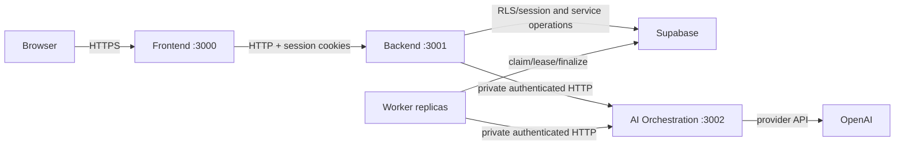

# Wardrobe AI

Wardrobe AI is a private clothing assistant for cataloging owned garments,
researching products, generating weather-aware outfits and plans, and creating
opt-in outfit visualizations.

The repository is a monorepo, but each production workload is an independent
project with an explicit network boundary:

| Project             | Responsibility                                                                         | May access                  |
| ------------------- | -------------------------------------------------------------------------------------- | --------------------------- |
| root `src/`         | Frontend: Next.js pages, browser interaction, SSR presentation, Backend HTTP client    | Backend only                |
| `backend/`          | Public API, sessions, authorization, business use cases, signed uploads, weather       | Supabase, AI Orchestration  |
| `worker/`           | Durable import, research, compilation, preview, visualization, and deletion jobs       | Supabase, AI Orchestration  |
| `ai-orchestration/` | Private, allow-listed model tasks, prompts, provider policy, OpenAI adapter            | OpenAI only                 |
| `database/`         | Supabase configuration, additive migrations, RLS, Storage policies, transactional RPCs | PostgreSQL/Supabase tooling |
| `contracts/`        | Shared public/private transport types; no business implementation                      | no runtime provider         |
| `infrastructure/`   | Independent containers, local topology, deployment guidance                            | deployable artifacts        |
| `legacy/`           | Isolated Vite prototype retained only for parity reference                             | no production imports       |

There is no duplicate `frontend/` directory: root `src/` is the only Frontend.
Frontend does not contain Route Handlers, jobs, database clients, provider SDKs,
or secrets. Browser `/api/*` and auth callback requests are rewritten to Backend,
so Frontend and Backend communicate over HTTP in local and production
environments. Backend and Worker also call AI Orchestration over authenticated
private HTTP; they never import its implementation.

## Runtime flow



Backend is stateless and horizontally scalable behind a load balancer. Worker
replicas coordinate through PostgreSQL leases and `FOR UPDATE SKIP LOCKED`;
`WORKER_CONCURRENCY` provides bounded vertical concurrency. AI Orchestration is
stateless and independently scalable. The database remains the durable source
of workflow truth.

## Local setup

Requirements: Node.js 22.13+, npm 10+, and a Supabase project or the Supabase
CLI.

```bash
npm install
cp .env.example .env.local
npx supabase start --workdir database
npx supabase db reset --workdir database
npm run dev
```

`npm run dev` starts Frontend on `:3000`, Backend on `:3001`, private AI
Orchestration on `:3002`, and the continuous Worker. Open
[http://localhost:3000](http://localhost:3000).

The complete, workload-partitioned environment template is
[`.env.example`](.env.example). Frontend receives only
`NEXT_PUBLIC_*`, `BACKEND_URL`, and browser-safe configuration. The Supabase
service role is Backend/Worker-only; OpenAI credentials and model identifiers
are AI-Orchestration-only. Never expose either group with a `NEXT_PUBLIC_`
prefix.

For containerized local parity:

```bash
docker compose --env-file .env.local -f infrastructure/local/compose.yaml up --build
```

## Commands

| Command                          | Purpose                                                      |
| -------------------------------- | ------------------------------------------------------------ |
| `npm run dev`                    | Start all four production workloads locally                  |
| `npm run dev:frontend`           | Start only Frontend                                          |
| `npm run check:quality`          | Format, lint, boundaries, types, unit tests, and every build |
| `npm run check`                  | Quality plus Supabase integration and Playwright E2E         |
| `npm run check:architecture`     | Cycles, ownership boundaries, and consolidation policy       |
| `npm run architecture:typecheck` | Typecheck Backend, Worker, and AI Orchestration              |
| `npm run architecture:test`      | Test Backend, Worker, and AI Orchestration                   |
| `npm run test:integration`       | Cross-service tests against local Supabase                   |
| `npm run test:e2e`               | Browser tests; requires local Supabase and Chromium          |
| `npm run bench:core`             | Bounded algorithm benchmarks                                 |
| `npm run audit:consolidation`    | Refresh the source-size inventory                            |

`check:quality` does not require provider credentials. The full `check` requires
local Supabase, applied migrations, and `npx playwright install chromium`.

## Architecture rules

- Split by runtime responsibility first and by product capability inside each
  runtime. Do not create a service for each file, feature, or table.
- Network contracts are versioned. Deployables cannot import another
  deployable's source or rely on its process memory/filesystem.
- Frontend presentation may be rich, but authorization, quotas, database truth,
  model prompts, and provider credentials remain server-side.
- AI proposes; deterministic code, ownership checks, RLS, quotas, and database
  constraints authorize persisted changes.
- Durable work uses leased, retryable, idempotent jobs. Request handlers enqueue
  and return status instead of performing long-running work inline.
- There is no file-length limit. Combine code that changes for the same reason;
  keep framework entry points, contracts, security seams, and retry boundaries
  separate even when short.

See [Architecture](docs/architecture.md), [Deployment](docs/deployment.md),
[Data model](docs/data-model.md), [Authentication](docs/authentication.md), and
the [source consolidation audit](docs/source-consolidation-audit.md).

## Legacy prototype

The old Vite/JSON prototype is isolated under `legacy/`. Use `legacy:*` scripts
only for parity review; production code must not import it. The legacy migration
is a dry run by default:

```bash
npm run migrate:legacy -- --user-id <uuid>
```

Add `--apply` only after reviewing the dry-run output.

## License

[MIT](LICENSE)
