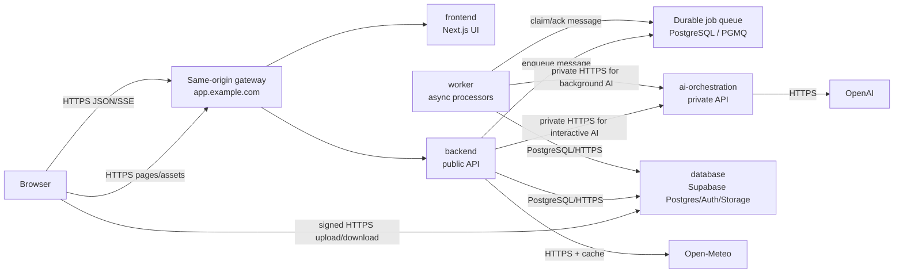
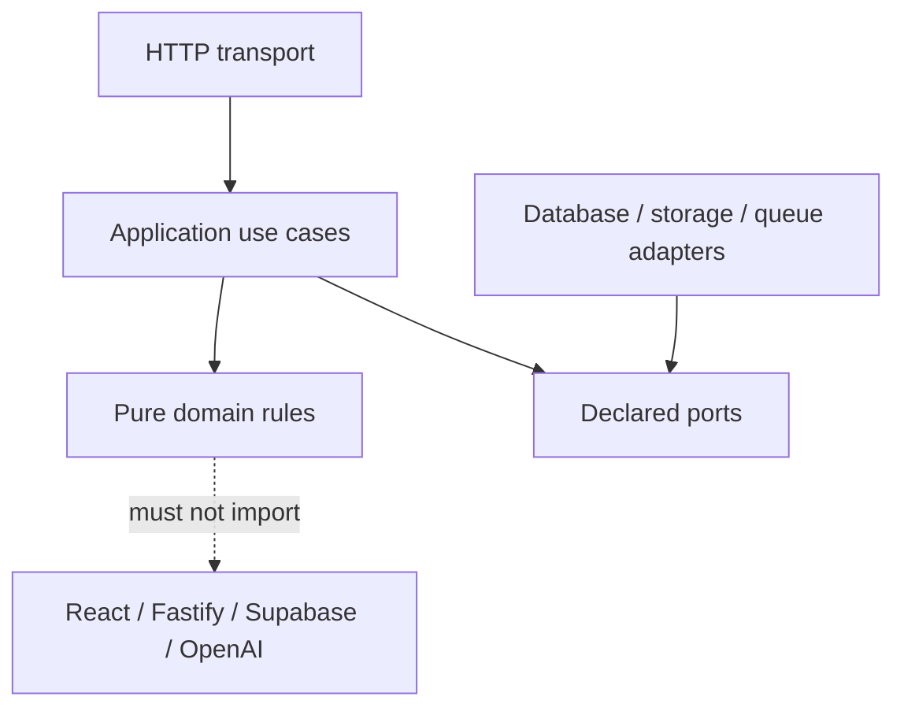

# Wardrobe AI architecture and performance review

> Implementation note (2026-08-14): the recommended physical split is now
> complete. Root `src/` is Frontend (there is no `frontend/` directory), Backend
> and all durable Worker families are extracted, provider code is private to AI
> Orchestration, and Supabase assets live under `database/`. Use
> [architecture.md](architecture.md) and [deployment.md](deployment.md) for
> current paths and operations. The measurements below remain the decision
> record that led to the implemented design; the final service-boundary audit
> and benchmark were rerun on 2026-08-17.

Status: implemented; retained as the research and decision record
Date: 2026-08-12
Scope: production application, database, AI orchestration, workers, algorithms, and repository rules

## 1. Executive decision

Wardrobe AI should remain one repository, but its production system should be
split into four independently deployable projects plus one managed data
platform:

1. `frontend` — the Next.js user experience;
2. `backend` — the public application API and business use cases;
3. `worker` — durable asynchronous processors;
4. `ai-orchestration` — a private, stateless model/provider service; and
5. `database` — Supabase/PostgreSQL/Auth/Storage source and deployment assets.

The deployables communicate only through network protocols or durable messages.
They never import another deployable's implementation source. A versioned
`contracts` project is the protocol source of truth and may generate clients for
each deployable at build time; that is compile-time contract reuse, not a local
runtime call.

Inside `backend`, organize code by business capability—not by technical folders
such as `controllers`, `services`, and `repositories`. The functional boundaries
are Account, Catalog, Intake, Context, Style Engine, Looks & Planning, Studio,
Insights, and Platform.

`scripts` must remain developer/operations automation. It must not become the
backend. A production server needs a lifecycle, HTTP contracts, authentication,
health checks, observability, graceful shutdown, and deployment configuration;
calling that code “scripts” hides those responsibilities.

## 2. Direct answer: which parts communicate locally?

If two parts are separate deployable projects, they do not communicate locally
in production.



The only local calls are calls between modules compiled into the same
deployable. For example, `backend`'s Catalog use case may call its Catalog
domain rules in memory. `backend` must call `ai-orchestration` over private
HTTPS because that is a different deployable. `backend` and `worker` communicate
through durable database/queue state rather than calling one another.

Development should mirror production with separate processes or containers on
different localhost ports. “Localhost” still uses TCP/HTTP and therefore tests
timeouts, serialization, authentication, and network failure behavior.

## 3. Why these physical boundaries fit this product

Service boundaries should follow a bounded context and business capability,
then be adjusted for scale, failure isolation, security, technology, and team
ownership. Microsoft's current guidance also warns that chatty calls indicate a
bad split. AWS recommends decomposition by stable business capabilities. This
rules out making every feature or database table a microservice.

The four selected deployables have genuinely different runtime characteristics:

| Project            | Reason for physical separation                                                                     |
| ------------------ | -------------------------------------------------------------------------------------------------- |
| `frontend`         | browser/SSR release cadence, static assets, accessibility, web performance, no provider secrets    |
| `backend`          | public trust boundary, short request budget, auth/RLS, transactional use cases, JSON/SSE           |
| `worker`           | long-running jobs, retries, controlled concurrency, Sharp/native CPU and memory, no browser wait   |
| `ai-orchestration` | OpenAI keys, model routing, schema validation, token/cost/rate controls, provider failure bulkhead |
| `database`         | migrations, constraints, RLS, atomic RPCs, queues, private object policies                         |

This is intentionally not “one microservice per feature.” All transactional
business capabilities initially remain in `backend` and one PostgreSQL
database. Splitting Catalog, Looks, Planner, and Studio into separate databases
would introduce distributed transactions and duplicated read models without a
measured need.

Next.js remains suitable for the frontend and can temporarily proxy requests,
but its own BFF guide says Route Handlers are public endpoints and not a full
backend replacement. The long-term backend should therefore be a conventional
Node service. Fastify 5 is a suitable target because it has explicit request
lifecycle hooks, schema validation/serialization, TypeScript support, and
structured logging. This is a migration choice, not permission for a big-bang
rewrite.

## 4. Target root layout

The target is deliberately flat because every main folder is a project or
system boundary visible at repository root:

```text
frontend/
  package.json
  src/
    app/                     # pages, layouts, route composition
    features/                # UI by product capability
    components/              # shared presentation primitives only
    api-client/              # generated public API client
  tests/

backend/
  package.json
  src/
    bootstrap/               # Fastify process, plugins, shutdown
    modules/
      account/
      catalog/
      intake/
      context/
      style-engine/
      looks/
      studio/
      insights/
    platform/                # auth, database, storage, queue, telemetry adapters
  tests/

worker/
  package.json
  src/
    runtime/                 # claim loop, lease, retry, heartbeat, shutdown
    handlers/
      import/
      research/
      compilation/
      previews/
      visualization/
      deletion/
  tests/

ai-orchestration/
  package.json
  src/
    api/                     # private authenticated task endpoints
    tasks/
      cataloging/
      product-research/
      occasion/
      curator/
      stylist-explanation/
      visualization/
    providers/
    policy/                  # budgets, model selection, safety, redaction
    evals/
  tests/

database/
  supabase/
    config.toml
    migrations/
    seed.sql
    tests/

contracts/
  public-api/openapi.yaml
  ai-private-api/openapi.yaml
  events/
  generated/                # generated, never hand-edited

infrastructure/
  local/                    # multi-process/container development
  deployment/
  observability/

scripts/                    # one-off development and operations commands only
legacy/                     # isolated Vite/JSON reference until removal
docs/
```

Use npm workspaces to run and install these projects from one repository. Do not
create a broad `shared` package containing business logic. Cross-deployable code
sharing easily becomes hidden coupling; share protocol schemas, generated
clients, observability conventions, and small inert primitives only.

## 5. Internal backend shape

Each business module has one public application surface:

```text
module/
  contract/                 # commands, queries, results, public DTO mapping
  domain/                   # pure rules and state transitions
  application/              # use cases and declared ports
  infrastructure/           # Supabase/storage/queue adapters
  transport/                # HTTP endpoint registration only
  tests/
```

Dependency direction:



Rules:

- transport authenticates, validates, calls one use case, and maps a result;
- domain code has no React, Next.js, Fastify, Supabase, OpenAI, `Request`, or
  `Response` dependency;
- a module owns every write to its tables/state machines;
- queries return purpose-built DTOs, never general database rows;
- other modules call the owner's application surface, not its adapter;
- AI output is a proposal and never directly authorizes or commits a write.

## 6. Data ownership

| Capability       | Primary owned state                                                                                |
| ---------------- | -------------------------------------------------------------------------------------------------- |
| Account          | profiles, style preferences, legal acceptance, MFA/account lifecycle                               |
| Catalog          | wardrobe items, stable item images/lineage, availability, favorites, wear facts                    |
| Intake           | import jobs/candidates, research runs/sources, job-scoped media                                    |
| Context          | normalized location/weather snapshots and occasion context where persisted                         |
| Style Engine     | compilation state/events, candidate versions/candidates, analysis cache, recommendation provenance |
| Looks & Planning | saved outfits, outfit members, plans/days, wear events                                             |
| Studio           | identity references, previews, visualizations, immutable snapshots, feedback                       |
| Platform         | usage counters, rate-limit state, storage-deletion jobs, operational audit state                   |

`database` owns schema deployment, not product meaning. The capability owner
defines a migration and the database project applies it. RLS remains enabled on
every exposed user-owned table. Service-role access stays limited to worker and
reviewed backend adapters and never reaches the frontend or AI service.

## 7. Network contracts and failure behavior

### Public frontend-to-backend API

- same-origin `/api/v1` through the gateway to avoid broad CORS and cookie
  configuration;
- secure, HTTP-only, same-site session cookies;
- JSON Schema/OpenAPI request and response definitions;
- stable machine error codes separate from user messages;
- idempotency key on retried commands and job creation;
- cursor pagination for unbounded collections;
- SSE only for bounded progress/assistant streaming; durable job status remains
  queryable after disconnect;
- signed direct-to-Storage upload/download for private media after backend
  authorization.

### Private backend/worker-to-AI API

- private network plus workload/service authentication;
- one endpoint per narrow task, not a generic “run prompt” endpoint;
- strict request/response schema and maximum media/text size;
- deadline propagated from caller; explicit provider timeout shorter than that
  deadline;
- task idempotency key and provider request ID;
- model/prompt/schema policy version in every result;
- retry only transient failures, with capped exponential backoff and jitter;
- no raw signed URLs, complete profiles, database credentials, or unrestricted
  arbitrary IDs.

### Worker communication

The backend enqueues a durable job and returns `202` plus a job resource. The
worker claims with a lease, processes bounded work, and records success,
retryable failure, or terminal failure. Multiple consumers may use
`FOR UPDATE SKIP LOCKED`; PostgreSQL explicitly documents this as appropriate
for queue-like tables. Queue messages contain an ID and type, while the owning
job table remains workflow truth.

## 8. Measured current architecture

The repository was measured with `npm run audit:architecture` after the first
boundary repairs in this review.

| Metric                                       | Result |
| -------------------------------------------- | -----: |
| TypeScript/TSX source files                  |  1,497 |
| Source lines                                 | 52,305 |
| Internal dependency edges                    |  3,986 |
| Import cycles                                |      0 |
| Cross-feature deep imports                   |     44 |
| Median file length                           |     33 |
| 95th percentile file length                  |     58 |
| Maximum file length                          |    312 |
| Files at or below 10 lines                   |    109 |
| Files at or below 25 lines                   |    480 |
| API `route.ts` files                         |     83 |
| API source files with direct table access    |     70 |
| Source files importing the admin DB client   |     51 |
| Tiny `index.ts` files at or below five lines |     24 |

The former 50-line rule was actively shaping the tree: 32% of source files are
25 lines or shorter and 24 tiny barrels exist, while file size itself did not
prevent two import cycles, 70 database-aware route families, or deep
cross-feature imports. This is why line count is now a diagnostic, not a gate.

### Exhaustive consolidation result

The first cohesion pass reduced the transition tree to 1,321 modules. The
subsequent exhaustive pass reviewed every source module, folded one-consumer
helpers into their owners, merged complete feature/domain families, and kept a
short file only for a framework, process, contract, security, runtime,
shared-presentation, or durable-workflow boundary.

| Metric                             | Initial audit | First pass | Exhaustive pass |
| ---------------------------------- | ------------: | ---------: | --------------: |
| TypeScript/TSX transition modules  |         1,497 |      1,321 |             262 |
| Source lines                       |        52,305 |     51,345 |          46,527 |
| Internal dependency edges          |         3,986 |      3,582 |             998 |
| Import cycles                      |             0 |          0 |               0 |
| Cross-feature deep imports         |            44 |         33 |              18 |
| Files at or below 10 lines         |           109 |         78 |               2 |
| Files at or below 25 lines         |           480 |        357 |              25 |
| Median file length                 |            33 |         36 |              74 |
| 95th percentile file length        |            58 |         63 |             859 |
| Tiny `index.ts` files ≤ five lines |            24 |         18 |               0 |

The transition module count fell by 1,235 modules (82.5%) from the original
audit and by 1,059 modules (80.2%) from the start of the exhaustive pass.
Longer cohesive files are intentional: complete functional owners are easier
to find than hundreds of one-use forwarding modules. The generated
[`source-consolidation-audit.md`](./source-consolidation-audit.md) accounts for
every retained active module below 50 lines and is checked in
`npm run check:architecture`.

Those figures are the pre-extraction consolidation snapshot. The implemented
service layout now contains 347 active TypeScript/TSX modules: 77 Frontend, 176
Backend, 55 Worker, 34 AI Orchestration, and 5 Contracts modules. The generated
inventory covers every retained file below 50 lines, while the boundary audit
verifies that Frontend contains no API, database, provider, or job
implementation.

## 9. Algorithm and feature audit

“Perfect” cannot be proved by inspection or one benchmark. Deterministic code
needs invariants, property/example tests, integration tests, and production
latency/error metrics. Model behavior additionally needs a representative,
versioned evaluation set. The status below distinguishes measured facts from
remaining validation work.

### 9.1 Account, auth, onboarding, and settings

Current design:

- Supabase Auth plus live-user checks for sensitive operations;
- RLS and restrictive MFA assurance policies;
- one-time signed action challenges, pre-auth rate limiting, legal acceptance,
  identity protection, and truthful account deletion state;
- database/network-bound work, not an in-memory algorithm bottleneck.

Complexity is normally O(1) database/auth operations per request. Correctness is
primarily security-state correctness rather than asymptotic speed. Existing
real-Supabase integration and E2E tests are the right proof mechanism. Extraction
must preserve same-origin cookie behavior, redirect sanitization, MFA assurance,
and RLS; it must not reproduce authorization only in application code.

### 9.2 Wardrobe catalog and text lookup

For `n` active rows and `q` query terms:

- fetch cost: `ceil(n / 500)` deterministic, user-scoped pages;
- match/filter cost: O(nq);
- current full rank: O(m log m) for `m` matches;
- result materialization: top 24.

Measured in memory: 500 rows rank in **0.122 ms mean / 0.198 ms p99** on this
development machine. The in-memory algorithm is negligible compared with the
database request. The previous unordered `.limit(500)` could silently miss
items and has been replaced with ordered pagination in search, recommendation
candidate loading, compilation input loading, and Insights loading.

Do not replace the current rank with a heap merely for theoretical purity; at
500 rows it saves no user-visible time. If closets grow into many thousands or
fuzzy recall becomes a requirement, move term filtering/ranking into PostgreSQL
with an indexed `tsvector` or `pg_trgm` search. PostgreSQL provides GIN/GiST
index support for full text and trigram similarity.

### 9.3 Intake and image processing

Pipeline:

```text
signed upload -> durable job -> decoded-byte validation/normalize
-> one scene analysis -> g review candidates -> g garment extractions
-> human correction -> atomic confirm RPC
```

Image work is O(pixels) and is bounded by decoded dimensions/pixel limits before
normalization. The AI portion is approximately:

```text
Timport = Tdownload + Tdecode + Tanalyze + sum(Textract[i]) + Tstore
```

The current extraction loop is sequential. That is safe for rate limits and
memory but makes latency grow linearly with garment count. Keep it until job
telemetry exists; then consider a semaphore of 2–3 extractions per job if
provider limits, memory, and cost budgets support it. Do not use unbounded
`Promise.all`. Node worker threads only help CPU-intensive JavaScript; they do
not help model/storage I/O, while Sharp already uses native worker facilities.

Correctness strengths: durable state, cancellation checks, per-candidate typed
failure, stable IDs, review before Catalog commit, and idempotent confirmation.
Required eval: diverse photos, occlusion, duplicates, accessories, multi-person
images, bad crops, unsupported media, and adversarial metadata.

### 9.4 Product research

One bounded research call produces proposed fields plus source evidence, then
sources are upserted and the run is completed. Runtime is provider/network
dominated; local processing is O(s) for `s` returned sources. The model cannot
overwrite user-confirmed facts, which is the correct authority rule.

Add a lease/attempt/next-attempt contract equal to the other durable job
families if the claim RPC does not already guarantee exclusive processing.
Evaluate source relevance, citation support, exact-product match, and calibrated
confidence separately; JSON-schema validity alone is not product correctness.

### 9.5 Weather and context

Forecast fetch is O(1) response size for one requested day and uses Next's
configured revalidation cache. Clothing constraint derivation is a fixed amount
of arithmetic and tagging. User-visible latency is external geocoding/forecast
latency, so cache hit rate, provider error rate, timeout, and stale-safe behavior
matter more than local optimization.

Occasion resolution is deterministic first and escalates to a narrow model task
only below a confidence threshold. This is cheaper, faster, and easier to test
than sending every phrase to a model.

### 9.6 Recommendation scoring and stylist

The pipeline correctly keeps hard rules outside the model:

```text
owned/available rows -> hard filters -> deterministic scores
-> at most 10 per garment role -> bounded candidate set
-> stored candidate retrieval or narrow model proposal
-> exact-ID structural validation -> optional atomic save
```

Filtering is O(n); ranking is O(n log n). Color compatibility for one outfit is
O(r²), where `r <= 5`, so it is effectively constant. The new batch outfit
scorer computes combination-wide color and layering once and applies the same
final outfit context to every item. This fixes the previous asymmetry where
optional pieces retained scores calculated before all pieces were present.

The model writes explanations or selects from authorized IDs; it does not own
availability, ownership, role structure, weather hard rules, or persistence.

### 9.7 Candidate compilation

Let:

- `D` = dresses, `T` = tops, `Btm` = bottoms;
- `F = min(D + T*Btm, 2000)` generated foundations;
- `f = min(F, 60)` foundations per occasion bucket;
- `O = 14` normalized occasion buckets;
- `W = 5` synthetic weather contexts;
- `w = min(f, 10)` foundations receiving weather variants;
- `V <= 12` optional layer/shoe/accessory variants.

The pre-dedup upper bound is:

```text
O * (f*V + w*W*V)
= 14 * (60*12 + 10*5*12)
= 18,480 variant evaluations
```

Foundation construction uses diagonal interleaving rather than a nested-loop
prefix, so every top and bottom gets representation before reuse. That avoids
the earlier dress/first-top bias. Foundation ranking is O(O * F log F).
Optional scoring is bounded by the constants above and grows linearly with each
optional-role pool after foundation limits are reached.

The original final planner repeatedly filtered and sorted all remaining
proposals for every selected candidate: roughly O(K * M log M), with a dynamic
score that made a single initial sort invalid. It now performs one best-candidate
scan per selection and caches static foundation/historical-wear facts:
O(K * M * r), with `r <= 5`, preserving the same greedy score and tie break.

Measured results from the final 2026-08-17 service-aware benchmark:

| Workload                   |       Mean |         p99 | Historical baseline |
| -------------------------- | ---------: | ----------: | ------------------: |
| rank 500 wardrobe rows     |   0.124 ms |    0.198 ms |                   — |
| build insights, 500 items  |   0.095 ms |    0.110 ms |                   — |
| construct proposals, 80    | 168.700 ms |  178.720 ms |                   — |
| compile 80 wardrobe items  | 185.750 ms |  190.360 ms |          1,182.6 ms |
| compile 500 wardrobe items | 742.380 ms | 1,074.06 ms |                   — |
| balance 1,000 proposals    |   0.449 ms |    0.555 ms |                   — |

These are background-job CPU times on one development machine, not production
SLO measurements. The current algorithm is acceptable for a personal wardrobe
and remains safely bounded. Target p95 is under 2 seconds for 500 items before
provider/curator time. Record wardrobe size, foundation count, proposal count,
dedupe count, selection count, duration, and peak memory in production.

### 9.8 Planner

Balanced selection deduplicates combinations, rejects unavailable/invalid
structures, applies historical and planned-use penalties, and limits foundation
reuse. For the common small `count` it is O(K*M*r). Measured selection of seven
looks from 1,000 proposals: **0.439 ms mean / 0.521 ms p99**. Local planner CPU is
not a bottleneck.

Correctness tests cover exact combination dedupe, dress versus top/bottom
foundations, availability, structure, and repeated garment balancing. Add
property tests for order independence, uniqueness, and invariants over random
wardrobes before changing the objective function.

### 9.9 Saved outfits, Today, and plans

These are mostly indexed reads and transactional commands. Their critical
algorithm is save-time validation against current owned items, not client-side
normalization. Multi-row saves remain atomic PostgreSQL RPCs. Performance must
be measured as query/RPC p50/p95/p99 and lock wait, not inferred from the small
TypeScript adapters.

### 9.10 Insights

Tallies are O(n*t) for a bounded average number of tags; sorting wear/cost/count
views is O(n log n). Measured complete Insights calculation for 500 items:
**0.094 ms mean / 0.111 ms p99**. It is already efficient. The important fix was
paginating the database input so statistics do not silently describe only the
first server result page.

### 9.11 Outfit previews and Studio visualization

Preview jobs re-check active candidate state, cutouts, consent, identity
reference, and quota immediately before generation. This is necessary because
queued authorization can become stale.

Studio visualization uses an immutable snapshot and a deterministic QA gate.
The content-correction budget is explicitly bounded:

```text
normal success:       1 generation + 1 assessment
correctable failure:  2 generations + 2 assessments maximum
terminal rejection:   never published as ready
```

Garment count is at most five, so local hotspot/geometry/QA checks are bounded;
provider image generation dominates time and cost. Track generation latency,
assessment latency, correction rate, QA pass rate, terminal reason, cost, and
identity/garment fidelity eval scores. Keep the AI service stateless: immutable
snapshots and result/job truth stay in the database owned by Backend/Worker.

### 9.12 Storage cleanup and account deletion

Deletion is O(a) remote object operations for `a` assets and must be durable,
retryable, and truthful. The product must never report complete while private
bytes remain. Throughput should be improved with a small bounded batch and
provider-safe concurrency, not an in-request deletion loop.

### 9.13 Frontend

No repository-only benchmark can prove browser performance. Measure field data
at the 75th percentile separately for mobile and desktop. Initial targets follow
Core Web Vitals: LCP <= 2.5 seconds, INP <= 200 ms, CLS <= 0.1. Also track route
JS bytes, image bytes, API waterfall length, hydration errors, accessibility
violations, and failed user actions.

The frontend is “thin,” but not non-functional. It owns accessibility,
presentation, browser-only state, input ergonomics, optimistic feedback, and
progress recovery. It does not own authorization, quotas, final business rules,
provider calls, or database truth.

## 10. Test and evaluation strategy

### Deterministic code

- unit tests for pure rules and state transitions;
- property tests for planners, keys, dedupe, pagination, and geometry;
- real PostgreSQL integration tests for RLS, MFA, RPC atomicity, job claims,
  idempotency, and two-user isolation;
- contract tests generated from both OpenAPI documents;
- end-to-end tests with fake model/image providers but real application,
  database, storage, and job transitions;
- load tests for API concurrency, queue claims, and the 500-item compilation
  case.

### AI behavior

Every task needs a versioned representative data set with ground truth or a
review rubric. Run evals before model, prompt, schema, or retrieval changes and
on a production sample after rollout. Measure schema success separately from
semantic success. OpenAI's guidance explicitly recommends representative test
data and structured outputs; structured output guarantees shape, not factual or
product correctness.

Minimum suites:

| Task             | Required eval dimensions                                               |
| ---------------- | ---------------------------------------------------------------------- |
| cataloging       | garment count, class, crop, colors, materials, uncertainty, duplicates |
| product research | source relevance, exact match, citation support, calibrated confidence |
| occasion         | intent/category/formality, ambiguous and adversarial inputs            |
| curator/stylist  | ownership, structure, weather, diversity, explanation support          |
| visualization    | identity, garment fidelity, artifacts, safety, localization            |

## 11. Observability and service objectives

Propagate one W3C trace context/correlation ID through Gateway, Frontend,
Backend, queue/job, Worker, AI service, provider, and database calls. Use
OpenTelemetry traces, metrics, and correlated logs. Never use user IDs, raw
prompts, signed URLs, or full paths as unbounded metric attributes.

Initial objectives to validate with production baselines:

| Signal                                     | Initial objective                             |
| ------------------------------------------ | --------------------------------------------- |
| ordinary authenticated backend read        | p95 < 500 ms                                  |
| ordinary transactional write               | p95 < 1 s                                     |
| assistant first SSE event                  | p95 < 1 s                                     |
| deterministic candidate compile, 500 items | p95 < 2 s CPU/job time                        |
| job start delay                            | < 2 scheduler intervals                       |
| job abandonment                            | zero; expired leases recover                  |
| cross-user data escape                     | zero; two-user RLS suite required             |
| visualization false-ready result           | zero; QA rejection cannot transition to ready |
| account deletion false-complete            | zero                                          |
| frontend Core Web Vitals                   | pass at p75 separately on mobile and desktop  |

## 12. Migration plan with exit criteria

A big-bang move of 1,497 files and 83 routes would create an unreviewable change
and make correctness claims weaker. Use a strangler migration where each phase
leaves the product deployable.

### Phase 0 — architecture hygiene (implemented in this review)

- remove the arbitrary 50-line ESLint/Claude rule;
- remove the per-prompt model/mode gate hook;
- retain secret/migration guards and actionable format/lint feedback;
- add repeatable architecture and algorithm benchmarks;
- remove current import cycles;
- move shared garment artwork out of Wardrobe ownership;
- fix unordered/capped 500-row correctness paths;
- optimize and correct candidate compilation scoring/selection.

Exit: lint, typecheck, unit tests, architecture audit, and benchmark suite pass.

Consolidation status: implemented across the complete active source tree. The
root transition application was reduced from 1,321 to 262 modules in the
exhaustive pass. Every remaining sub-50-line active module is classified in
[`source-consolidation-audit.md`](./source-consolidation-audit.md); the audit
fails when a new short module has no approved boundary.

### Phase 1 — contract-first public API (implemented)

- create the root npm workspaces and independently buildable process shells;
- create `contracts/public-api/openapi.yaml` and `contracts/ai-private-api/openapi.yaml`;
- enforce that deployables share contracts only and never implementation source;
- standardize `/api/v1`, error envelope, auth cookie, pagination, idempotency,
  request ID, and SSE events;
- generate the frontend client;
- make frontend code call only the generated network client;
- run current and new APIs in the existing deployment during migration.

Exit: no frontend feature imports server/database/AI/job implementation.

Completion status: public and private contracts, the Frontend HTTP bridge,
service lifecycles, and cross-project import enforcement build and test
independently. Frontend calls Backend through the network and contains no
server implementation.

### Phase 2 — backend project (implemented)

- create the Fastify process and move one vertical capability at a time;
- start with Catalog read/search and Insights, then writes, Looks/Planner,
  Account, Intake, Style Engine, and Studio;
- routes call application use cases; adapters own Supabase calls;
- gateway sends `/api/v1` to Backend.

Exit: current Next Route Handlers are compatibility proxies or removed; no
Backend implementation is imported by Frontend.

Completion status: public routes, auth callbacks, server adapters, use cases,
deterministic business algorithms, and weather integration live under
`backend/`; no durable processor or OpenAI SDK remains there.

### Phase 3 — database project (implemented)

- move Supabase configuration, migrations, seed, and DB tests under `database`;
- preserve every historical migration byte-for-byte during the move;
- add table/module ownership metadata and query/index baselines;
- introduce PGMQ only if it improves measured queue operations.

Exit: local reset, CI integration, RLS/MFA, concurrency, and storage tests pass
from the new path.

Asset-move status: complete. `database/supabase/` is the canonical CLI workdir;
all 28 moved files retained the same aggregate SHA-256 content hash before and
after the move. Live integration and E2E verification still require local
Supabase and Chromium.

### Phase 4 — AI orchestration service (implemented)

- define private task contracts and service authentication;
- adapt the existing OpenAI/provider interfaces to an HTTP client;
- move one task at a time, starting with background curator/research, then
  visualization, then latency-sensitive stylist/occasion tasks;
- add deadlines, budgets, cache policy, rate limits, redaction, and eval gates.

Exit: Backend/Worker contain no OpenAI key or SDK import and cannot issue an
arbitrary prompt; all AI tasks pass contract and eval suites.

Completion status: provider clients, model configuration, prompts, and
allow-listed task execution live only under `ai-orchestration/`. The service is
stateless, private, token-authenticated, deadline-aware, and has no database
SDK.

### Phase 5 — worker project (implemented)

- extract the common lease/retry/heartbeat runtime;
- move import, research, compilation, previews, visualization, and deletion;
- worker calls Database and AI service over network only;
- stop invoking worker handlers inside public request processes except an
  explicit development-only adapter.

Exit: crash/retry/idempotency/load tests pass, and Web/API deploys cannot stop or
duplicate durable jobs.

Completion status: all six durable families—import, research, compilation,
previews, visualization, and deletion—run only in Worker. Its dispatcher uses
database claims, leases, bounded concurrency, retry/backoff, and graceful
shutdown. Compilation implementation and tests are Worker-owned.

### Phase 6 — frontend and legacy cleanup (implemented)

- retain the consolidated UI in root `src/`, the canonical Frontend project;
- delete compatibility proxies and forbidden cross-project imports;
- move or remove legacy Vite/JSON code after parity approval;
- enforce dependency boundaries in CI.

Exit: each project builds/tests/deploys independently, local development uses
the same network contracts, and the architecture audit reports no forbidden
cross-project source dependencies.

Completion status: root `src/` is the canonical Frontend (there is deliberately
no duplicate `frontend/` folder), compatibility server implementations were
removed, and the Vite/JSON prototype is isolated in the independently buildable
`legacy/` workspace.

## 13. Rules replacing line-count enforcement

There is no maximum lines-per-file rule. Review a file when it has multiple
reasons to change, crosses ownership/runtime boundaries, has an imprecise name,
or is difficult to test. Split at those seams. Combine files when they are
trivial pass-through modules or barrels that increase navigation without
creating ownership, reuse, or a test seam.

Useful enforceable rules are:

- no dependency cycles;
- no frontend import from Backend, Worker, AI, admin DB, or provider SDKs;
- no Backend/Worker import from AI implementation;
- no AI service database access;
- no transport-layer domain table orchestration;
- no cross-capability deep import; use a declared public contract;
- no production import from Legacy;
- no historical migration edits;
- no model output committed without deterministic authorization/validation.

## 14. Primary research sources

- [ESLint `max-lines`: no objective maximum and rule usage guidance](https://eslint.org/docs/latest/rules/max-lines)
- [Microsoft: use domain analysis to model microservices](https://learn.microsoft.com/en-nz/azure/architecture/microservices/model/domain-analysis)
- [Microsoft: identify microservice boundaries and avoid chatty calls](https://learn.microsoft.com/en-us/azure/architecture/microservices/model/microservice-boundaries)
- [Microsoft: microservices architecture practices and antipatterns](https://learn.microsoft.com/en-us/azure/architecture/microservices/)
- [AWS: decompose by business capability](https://docs.aws.amazon.com/prescriptive-guidance/latest/modernization-decomposing-monoliths/decompose-business-capability.html)
- [Next.js: Backend for Frontend guide](https://nextjs.org/docs/app/guides/backend-for-frontend)
- [Fastify: validation and serialization](https://fastify.dev/docs/latest/Reference/Validation-and-Serialization/)
- [npm workspaces](https://docs.npmjs.com/cli/using-npm/workspaces/)
- [Supabase Row Level Security](https://supabase.com/docs/guides/database/postgres/row-level-security)
- [Supabase Queues/PGMQ](https://supabase.com/docs/guides/queues/quickstart)
- [PostgreSQL `SELECT`, deterministic ordering, and `SKIP LOCKED`](https://www.postgresql.org/docs/current/sql-select.html)
- [PostgreSQL `pg_trgm` indexed similarity search](https://www.postgresql.org/docs/current/pgtrgm.html)
- [OpenAI structured outputs](https://developers.openai.com/api/docs/guides/structured-outputs)
- [OpenAI evals](https://developers.openai.com/api/docs/guides/evals)
- [OpenAI production best practices](https://developers.openai.com/api/docs/guides/production-best-practices)
- [OpenAI safety best practices](https://developers.openai.com/api/docs/guides/safety-best-practices)
- [OpenTelemetry observability primer](https://opentelemetry.io/docs/concepts/observability-primer/)
- [Node.js worker threads](https://nodejs.org/api/worker_threads.html)
- [web.dev Core Web Vitals](https://web.dev/articles/vitals)
