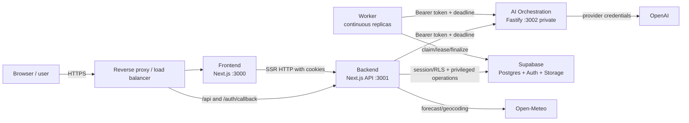

# Wardrobe AI architecture

Status: implemented
Last updated: 2026-08-14

## Decision

Wardrobe AI uses a monorepo with four independently deployable runtimes, a
database project, and a contract package. The physical split follows runtime
trust and scaling needs; code inside each runtime is grouped by product
capability.

```text
src/                 Frontend (the root Next.js project)
backend/             public API and business application
worker/              durable background execution
ai-orchestration/    private AI gateway and provider policy
database/            Supabase/PostgreSQL/Auth/Storage assets
contracts/           transport contracts only
infrastructure/      containers and topology
legacy/              isolated prototype
```

Root `src/` is intentionally the Frontend. There is no second `frontend/`
project and no server business implementation under Frontend.

## Containers and trust boundaries



Only Frontend and Backend are reachable from the edge. AI Orchestration and
Worker stay on a private network. Worker exposes no HTTP port. Supabase is the
durable system of record; model output never directly authorizes a write.

## Ownership matrix

| Owner            | Owns                                                                                                                                       | Must not own                                                        |
| ---------------- | ------------------------------------------------------------------------------------------------------------------------------------------ | ------------------------------------------------------------------- |
| Frontend         | layouts/pages, presentation, accessibility, interaction state, upload progress, same-origin Backend bridge                                 | secrets, database/provider SDKs, authorization truth, jobs, prompts |
| Backend          | sessions, auth callbacks, validation, authorization, quotas, API DTOs, use cases, signed upload coordination, deterministic rules, weather | UI, OpenAI SDK/model configuration, durable processors              |
| Worker           | leased claims, retries/backoff, import/research/compilation/preview/visualization/deletion handlers                                        | public user routes, browser sessions, provider SDK/prompt policy    |
| AI Orchestration | private allow-listed tasks, prompt building, structured output, provider adapters and model selection                                      | database access, product authorization, sessions, workflow truth    |
| Database         | tables, RLS, private Storage policy, constraints, atomic RPCs, idempotency and durable queues                                              | UI and provider orchestration                                       |
| Contracts        | public DTOs, private task envelopes, job/event types                                                                                       | framework or business implementation                                |

The automated boundary check rejects cross-owner implementation imports and
forbidden dependencies. Local development follows the same HTTP paths as
production.

## Capability ownership inside services

Each runtime groups implementation by the product function it performs:

| Capability        | Frontend                    | Backend                                                   | Worker                                | AI Orchestration / Database                         |
| ----------------- | --------------------------- | --------------------------------------------------------- | ------------------------------------- | --------------------------------------------------- |
| Account           | auth/onboarding/settings UI | session, OAuth/callbacks, MFA, legal, export/deletion API | deletion cleanup                      | Auth, RLS, account RPCs                             |
| Catalog           | wardrobe UI                 | items, uploads, signed URLs, search                       | compilation triggers                  | catalog/extraction tasks; wardrobe tables           |
| Intake & research | import/review UI            | enqueue/confirm/accept commands                           | import and research processors        | garment/research tasks; durable job tables          |
| Context           | weather presentation        | geocoding, forecast, deterministic constraints            | job-time forecast access              | occasion interpretation task                        |
| Style engine      | stylist experience          | retrieval, filtering, validation, chat use cases          | candidate compilation/curation        | style tasks; candidate/agent tables                 |
| Looks & planning  | outfits/planner/today UI    | outfit/plan/wear commands and validation                  | preview generation                    | planning/explanation tasks; transactional RPCs      |
| Studio            | studio interaction          | identity consent, visualization commands/downloads        | preview/visualization pipeline        | image/QA/localization tasks; private media metadata |
| Insights          | charts and states           | deterministic analytics                                   | none                                  | indexed relational data                             |
| Platform          | safe error/status UI        | rate limits, idempotency, health                          | retries, cleanup, operational metrics | feature limits, queues, audit tables                |

This is not one microservice per feature. Account, Catalog, Looks, and Insights
share transactional application behavior in Backend. A new deployable is
justified only by a different trust boundary, scaling profile, failure mode, or
provider responsibility.

## Request and job flows

### Interactive request

1. The browser sends a same-origin request to Frontend.
2. the Next rewrite forwards `/api/*` or an auth callback to Backend; SSR code
   calls `BACKEND_URL` directly and forwards the session cookie.
3. Backend authenticates, validates bounded input, authorizes ownership, and
   applies rate/idempotency rules.
4. Backend runs deterministic work and a database transaction, optionally
   calling the private AI task API with an explicit deadline.
5. Backend returns a versioned DTO; Frontend only presents it.

### Durable job

1. Backend atomically enqueues a database job and returns `202`/status data.
2. Worker replicas claim bounded batches with leases and `SKIP LOCKED`.
3. A handler performs idempotent I/O and calls an allow-listed AI task when
   needed.
4. The Worker transactionally finalizes, schedules retry/backoff, or records a
   terminal error. Expired leases make crashed work recoverable.
5. Frontend polls the public status API; it never calls Worker or AI directly.

## Scaling and performance

- Frontend and Backend are stateless standalone Next.js images. Scale replicas
  horizontally behind a reverse proxy; scale vertically for CPU/memory only
  after measuring saturation.
- Worker horizontal scale is safe because the queue uses row locks and leases.
  `WORKER_CONCURRENCY` bounds simultaneous handlers in each replica. Start low:
  image decoding and generation are memory/provider heavy.
- AI Orchestration is stateless and independently scalable. Apply provider
  concurrency and rate limits centrally instead of duplicating them in callers.
- Keep hot deterministic filtering bounded before any model call. Compilation
  precomputes candidate libraries; user requests retrieve and rank a bounded
  set instead of exploring the combinatorial wardrobe space live.
- Database constraints/RPCs make multi-row transitions atomic. Index ownership,
  status, due-time, and lease columns used by queues and user-scoped reads.
- Observe p50/p95/p99 latency, error rate, queue age, claim conflicts, retry
  count, provider latency/cost, and database saturation before changing scale.

## Security invariants

- Browser bundles contain no Supabase service credential, AI token, OpenAI key,
  model identifier, provider prompt, or private database implementation.
- Backend and Worker may hold separate Supabase server credentials. Migrate from
  the legacy service-role JWT to scoped Supabase secret keys where platform
  compatibility permits, and rotate each workload independently.
- AI Orchestration is private, requires constant-time Bearer authentication,
  accepts only named tasks with bounded payloads, honors deadlines, and exposes
  no generic prompt endpoint.
- RLS remains enabled on every user-owned table and private bucket. Privileged
  code performs explicit ownership validation even when credentials bypass RLS.
- Private uploads use short-lived signed URLs after Backend authorization;
  decoded image validation and normalization occur server-side.
- Logs contain safe identifiers/summaries, never secrets, raw prompts, private
  images, signed URLs, or precise private location.

## Source-file policy

Architecture is not a line-count contest. There is no 50-line minimum or
maximum. Combine files when they have the same owner, reason to change, tests,
and lifecycle. Keep short files when required by a framework route, a public
contract, a security boundary, or a durable retry seam. The generated
[source consolidation audit](source-consolidation-audit.md) makes remaining
small modules visible without padding or unsafe merging.

## Further reading

- [Deployment](deployment.md)
- [Database model](data-model.md)
- [Authentication](authentication.md)
- [Implemented migration map](architecture-migration-map.md)
- [Research and performance review](architecture-and-performance-review-2026-08-12.md)
