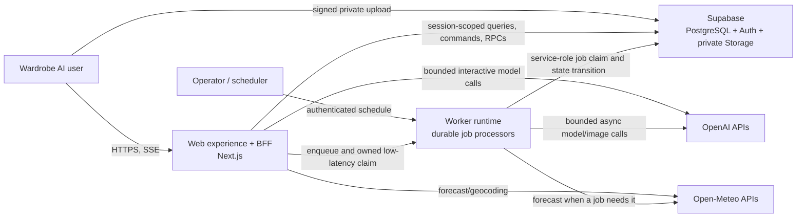
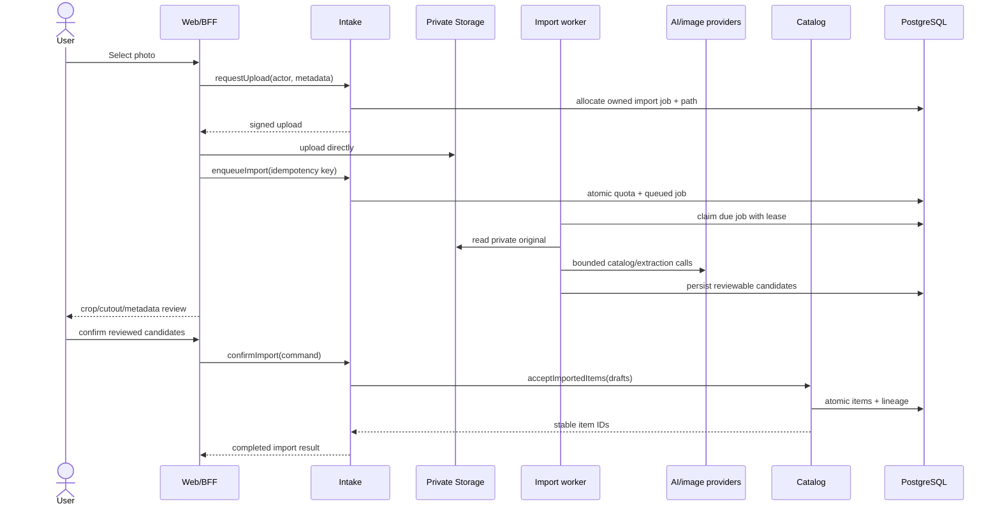
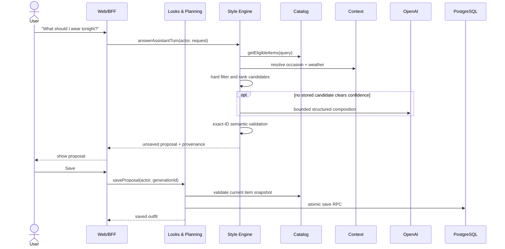

# Wardrobe AI system design: functional boundaries

Status: proposed target architecture  
Date: 2026-07-30  
Scope: production Next.js application, Supabase data platform, AI pipelines, and background workers

## 1. Decision

Wardrobe AI should be a **domain-oriented modular monolith with two runtime
entry points**:

1. a web experience and Backend-for-Frontend (BFF); and
2. durable background workers.

Both runtimes should initially use the same repository, the same domain modules,
and one Supabase/PostgreSQL database. The project should be divided primarily by
the user capability each module owns, not by horizontal technical departments
such as "frontend", "backend", and "database".

The recommended functional modules are:

1. Account & Preferences
2. Wardrobe Catalog
3. Intake & Enrichment
4. Context (weather, location, occasion)
5. Style Engine & Assistant
6. Looks & Planning
7. Studio & Visualization
8. Insights
9. Platform

Each functional module contains its own UI, use cases, domain rules, ports, and
data adapters. The frontend stays intentionally thin, but it is not
"non-functional": it owns presentation, accessibility, browser-only behavior,
temporary interaction state, and progress feedback. It does **not** own
authorization, quotas, business invariants, AI/provider calls, or final data
truth.

Do not create separate microservices or separate frontend/backend repositories
now. First make the boundaries enforceable inside the existing application.
Extract a deployable only when measurements show that it needs independent
scaling, reliability, release cadence, or ownership.

## 2. Why this fits the current project

The current repository is already a capable production application rather than
a small UI prototype:

- Next.js App Router with server and client components;
- 81 Route Handler entry points under `src/app/api`;
- approximately 1,500 TypeScript/TSX files;
- 41 PostgreSQL tables created by the migrations;
- private Supabase Auth, RLS, Storage, and transactional RPCs;
- six durable job families for import, research, compilation, previews,
  visualizations, and storage deletion;
- deterministic recommendation, style, validation, and weather code;
- bounded OpenAI cataloging, research, styling, planning, image, and
  visualization calls;
- a still-present legacy Vite application that is intentionally outside the
  production boundary.

The project therefore needs stronger module ownership, but it still benefits
from local transactions and coordinated changes across the wardrobe,
recommendation, planning, and visualization features.

The research supports that direction:

- AWS recommends drawing boundaries around business domains and explicitly
  lists organizing teams around UI, middleware, or databases as an
  anti-pattern.
- AWS's subdomain decomposition guidance classifies domains as core,
  supporting, or generic and uses bounded contexts as the service boundary.
- Microsoft's boundary guidance starts from bounded contexts and cohesive
  business aggregates rather than technical layers.
- Microservice decomposition adds operational and data-consistency costs.
  Stable boundaries should be learned before turning modules into networked
  services.
- Next.js supports a BFF, but its own documentation says those endpoints are
  public, require authentication/validation, are not a complete backend
  replacement, and may be terminated by serverless runtime limits.

For Wardrobe AI, a modular monolith gives the important part of service design
now—clear ownership and dependency rules—without adding distributed
transactions, network failure modes, duplicated schemas, and multiple
deployments before they are justified.

## 3. Architecture principles

### 3.1 Split by business capability

A module owns a recognizable user or product capability and the language used
inside it. For example, an `import candidate` belongs to Intake; a confirmed
`wardrobe item` belongs to Catalog; an `outfit proposal` belongs to the Style
Engine; and a saved `outfit` belongs to Looks & Planning.

Do not create CRUD services named after individual tables. A table is an
implementation detail of a capability, not automatically a service boundary.

### 3.2 One owner for every write

Every mutable table, Storage path class, state machine, and invariant has one
owning module. Other modules call that owner's public command or consume a
published read model/event. They do not update the owner's tables directly.

### 3.3 Thin transports, rich use cases

Pages, Route Handlers, cron endpoints, and worker entry points are transports.
They should:

1. authenticate the caller;
2. parse and validate input;
3. call one application use case;
4. map the typed result to HTML, JSON, SSE, or a worker outcome.

They should not contain business workflows or raw multi-table orchestration.

### 3.4 Deterministic rules surround AI

Models propose; deterministic code authorizes, filters, validates, budgets, and
commits. Structured model output is a parsing boundary, not proof that the
result is safe or correct.

### 3.5 Durable state for durable work

Long-running imports, research, compilation, image generation, visualization,
and deletion remain durable jobs with leases, bounded attempts, idempotency,
and inspectable terminal states. Browser refreshes and serverless timeouts
cannot be allowed to erase work.

### 3.6 Logical separation before physical separation

Code boundaries, table ownership, contracts, tests, and observability come
first. A module becoming a network service is a later deployment decision, not
the starting definition of good architecture.

## 4. System context and containers



### Container responsibilities

| Container            | Owns                                                                                         | Must not own                                                                        |
| -------------------- | -------------------------------------------------------------------------------------------- | ----------------------------------------------------------------------------------- |
| Web experience       | rendering, accessibility, interaction state, forms, upload progress, optimistic presentation | authorization truth, cross-user data access, AI secrets, final business invariants  |
| BFF / HTTP transport | session resolution, input schemas, rate-limit entry points, DTO mapping, SSE/HTTP semantics  | domain algorithms, direct provider-specific workflows, long-running lifecycle state |
| Application modules  | use-case orchestration, domain rules, ports, typed commands/results                          | HTTP details, React state, deployment-specific scheduling                           |
| Worker runtime       | claiming jobs, execution budgets, retry classification, heartbeats, metrics                  | product rules duplicated from modules                                               |
| PostgreSQL           | transactions, RLS, ownership constraints, atomic RPCs, durable job and audit state           | UI view state, model reasoning, signed URLs                                         |
| Private Storage      | original and derived private media bytes                                                     | authorization decisions based only on client paths or MIME types                    |
| External providers   | model inference, image generation, weather/geocoding                                         | product authorization or persisted source of truth                                  |

The BFF and web experience may be one Next.js deployable. They are separate
responsibilities even when they run in the same process.

## 5. Functional modules

### 5.1 Account & Preferences — supporting/generic

**Purpose:** identity-facing account lifecycle and the preferences required by
the rest of the product.

**Owns**

- signup/login/callback/recovery/MFA flows around Supabase Auth;
- profile, timezone, temperature unit, style and activity preferences;
- legal acceptance, reauthentication, account export and deletion;
- identity/provider presentation in Settings;
- account-level consent flags.

**Data owner**

- `profiles`
- `style_profiles`
- `legal_acceptances`
- `auth_action_challenges`
- `auth_rate_limits`
- `auth_events`
- `account_deletion_requests`

**Public contracts**

- `getViewer()`
- `getStylePreferences(userId)`
- `getConsentCapabilities(userId)`
- `updateProfile(command)`
- `beginAccountDeletion(command)`

Supabase Auth remains the identity provider. This module adapts it to Wardrobe
AI's account rules; it does not recreate an authentication service.

### 5.2 Wardrobe Catalog — core domain

**Purpose:** the authoritative digital record of clothing the user owns.

**Owns**

- item lifecycle and confirmed metadata;
- availability, favorite, archive, soft-delete, and item-level wear state;
- image metadata and immutable image lineage references;
- wardrobe search and item read models;
- item ownership and cross-user link invariants.

**Data owner**

- `wardrobe_items`
- `wardrobe_item_images`

**Public contracts**

- `createManualItem(command)`
- `acceptImportedItems(command)`
- `updateItem(command)`
- `setAvailability(command)`
- `markItemWorn(command)`
- `getItem(query)`
- `searchWardrobe(query)`
- `getEligibleItems(query)`

Catalog accepts reviewed item facts; it does not know how Intake or AI produced
the proposal.

### 5.3 Intake & Enrichment — core/supporting

**Purpose:** convert user media and clues into reviewable catalog proposals.

**Owns**

- signed upload intent for import/label media;
- decoded-image validation, normalization, EXIF removal, cropping, and cutouts;
- cataloging and extraction workflow;
- import and candidate state machines;
- product research, evidence, confidence, acceptance/rejection workflow;
- promotion of approved derivative assets into stable Catalog lineage.

**Data owner**

- `import_jobs`
- `import_job_candidates`
- `item_research_runs`
- `research_sources`

**Public contracts**

- `enqueueImport(command)`
- `getImport(query)`
- `reviewCandidate(command)`
- `confirmImport(command)` → calls Catalog's import acceptance command
- `enqueueResearch(command)`
- `decideResearchProposal(command)`
- worker contracts for claiming and processing owned/service jobs

The final confirmation boundary is explicit: Intake owns proposals and job
state; Catalog owns confirmed items.

### 5.4 Context — supporting

**Purpose:** turn location, date, weather, and occasion into a small,
privacy-aware context used by recommendation and planning.

**Owns**

- Open-Meteo adapter;
- geocoding and forecast DTOs;
- effective-temperature and clothing constraints;
- occasion normalization, dress-code context, time-of-day rules;
- weather degradation policy and cache behavior.

**Data owner**

- no dedicated product table initially;
- Account owns persisted location preferences;
- persisted snapshots embedded in outfits/plans are owned by Looks & Planning.

**Public contracts**

- `resolveWeatherContext(query)`
- `resolveOccasionContext(query)`
- `deriveClothingConstraints(input)`

No module receives raw location fields unless its use case needs them. Published
results should be the minimum forecast/context subset.

### 5.5 Style Engine & Assistant — core differentiator

**Purpose:** generate safe, coherent, exact-owned-item style proposals.

**Owns**

- deterministic eligibility filters, role/foundation validation, scoring,
  color, layering, silhouette, material, archetype, and diversity rules;
- compiled outfit-candidate library and its version publication;
- candidate retrieval and fallback composition;
- stylist/orchestrator intent routing and assistant conversations;
- AI prompts/schemas for styling, planning, catalog curation, and variants;
- safe agent summaries and provider usage traces;
- response validation and confidence policy.

**Data owner**

- `wardrobe_change_events`
- `wardrobe_compilation_state`
- `wardrobe_compilation_jobs`
- `outfit_candidates`
- `outfit_candidate_items`
- `outfit_analysis_cache`
- `conversations`
- `messages`
- `agent_runs`

**Public contracts**

- `compileWardrobe(command)`
- `proposeOutfits(query)`
- `proposePlan(query)`
- `proposePackingList(query)`
- `proposeVariants(query)`
- `answerAssistantTurn(command)`

The output is an `OutfitProposal` or `PlanProposal`, never a saved outfit. It
contains exact owned IDs and provenance required for deterministic
revalidation.

### 5.6 Looks & Planning — core domain

**Purpose:** manage the user's accepted combinations, future plans, actual wear,
and feedback.

**Owns**

- manual and generated outfit persistence;
- outfit membership and roles;
- plans and saved generated weeks;
- swaps, availability checks, and atomic wear recording;
- immutable wear history;
- outfit feedback;
- Today read model assembled from plans, outfits, and context snapshots.

**Data owner**

- `outfits`
- `outfit_items`
- `outfit_plans`
- `wear_logs`
- `wear_log_items`
- `outfit_feedback`
- `generated_outfit_saves`
- `generated_plan_saves`

**Public contracts**

- `saveOutfit(command)`
- `saveProposal(command)`
- `savePlanProposal(command)`
- `swapOutfitItem(command)`
- `markOutfitWorn(command)`
- `getToday(query)`
- `listOutfits(query)`
- `listPlans(query)`

This module revalidates a Style Engine proposal at save time. A stale proposal
cannot bypass current ownership, activity, availability, role, or foundation
rules.

### 5.7 Studio & Visualization — core differentiator

**Purpose:** create opt-in, identity-aware visual representations of owned-item
outfits without claiming physical fit accuracy.

**Owns**

- private identity-reference consent, suitability, activation, and revocation;
- preview and visualization requests;
- immutable input snapshots and staleness detection;
- image-provider capabilities and generation QA;
- correction/regeneration lifecycle;
- hotspot mapping, garment details, download labels, and feedback;
- clear AI-generated labeling.

**Data owner**

- `profile_identity_references`
- `outfit_preview_jobs`
- `outfit_visualization_jobs`
- `outfit_visualizations`
- `outfit_visualization_items`
- `outfit_visualization_feedback`

**Public contracts**

- `setIdentityReference(command)`
- `requestPreview(command)`
- `requestVisualization(command)`
- `getVisualization(query)`
- `regenerateVisualization(command)`
- `recordVisualizationFeedback(command)`

Studio receives item snapshots and approved private asset references through
Catalog/Looks contracts. It does not edit wardrobe metadata.

### 5.8 Insights — supporting/read model

**Purpose:** explain wardrobe composition and behavior without changing source
records.

**Owns**

- category/palette/usage aggregations;
- cost-per-wear;
- unworn and rediscovery views;
- foundation gap analysis;
- safe assistant insight answers.

**Data owner**

- no transactional table initially;
- reads Catalog and Looks projections;
- add an Insights-owned materialized projection only when query cost or latency
  requires it.

**Public contracts**

- `getWardrobeInsights(query)`
- `answerInsightQuestion(query)`

### 5.9 Platform — generic capability

**Purpose:** provide secure, replaceable technical adapters without containing
Wardrobe business rules.

**Owns**

- Supabase browser/session/admin clients;
- HTTP request/response and environment configuration;
- private Storage signing/deletion mechanics;
- OpenAI client and provider request IDs;
- idempotency, feature quotas, rolling limits;
- worker authentication, scheduler integration, queue primitives;
- logs, traces, metrics, health checks, redaction;
- shared UI primitives and design tokens as a separate presentation package.

**Data owner**

- `api_idempotency_keys`
- `feature_limits`
- `feature_usage_counters`
- `rate_limit_events`
- `storage_deletion_queue`

Platform may know _how_ to persist, sign, call, meter, or observe. It must not
decide what makes an outfit valid or when an import candidate is approved.

## 6. Module dependency map

```mermaid
flowchart TD
    experience["Experience composition<br/>pages, components, BFF transports"]
    account["Account & Preferences"]
    catalog["Wardrobe Catalog"]
    intake["Intake & Enrichment"]
    context["Context"]
    style["Style Engine & Assistant"]
    looks["Looks & Planning"]
    studio["Studio & Visualization"]
    insights["Insights"]
    platform["Platform adapters"]

    experience --> account
    experience --> catalog
    experience --> intake
    experience --> style
    experience --> looks
    experience --> studio
    experience --> insights

    intake -->|confirmed item command| catalog
    style -->|eligible item query| catalog
    style --> context
    looks -->|proposal query| style
    looks -->|current item validation| catalog
    studio -->|item snapshots| catalog
    studio -->|look snapshots| looks
    studio -->|consent capability| account
    insights -->|read projection| catalog
    insights -->|read projection| looks

    account --> platform
    catalog --> platform
    intake --> platform
    context --> platform
    style --> platform
    looks --> platform
    studio --> platform
    insights --> platform
```

The arrows are allowed compile-time dependencies. Reverse imports are not
allowed. Feedback from Looks to the Style Engine should be delivered as an
event/projection, not by making both modules call one another.

## 7. Internal shape of every module

Use a small hexagonal structure inside each functional boundary:

```text
module/
  public.ts              # the only cross-module import surface
  contracts/             # stable commands, queries, DTOs, events
  domain/                # pure rules, value objects, state transitions
  application/           # use cases and ports
  infrastructure/        # Supabase, Storage, OpenAI, Open-Meteo adapters
  ui/                    # feature components, hooks, browser API clients
  tests/
```

Dependency rules:

```text
app/pages/routes/workers -> module public application API
module UI                -> its contracts + shared UI
module application       -> its domain + declared ports
module infrastructure    -> implements its application ports
module domain            -> TypeScript only
cross-module code        -> target module's public.ts only
```

Forbidden dependencies:

- `domain` importing React, Next.js, Supabase, OpenAI, `Request`, or `Response`;
- client/UI code importing server-only modules, admin clients, jobs, or provider
  SDKs;
- Route Handlers issuing domain table queries directly;
- one module deep-importing another module's components or internal types;
- generic `utils`, `services`, or `helpers` folders becoming unowned dumping
  grounds;
- a shared DTO that exposes a database row shape to every module.

Enforce these with ESLint `no-restricted-imports`, server-only entry points, and
architecture tests. The current cross-feature deep imports—especially shared
wardrobe artwork/types and outfit-role types—should move to deliberately owned
public contracts or shared presentation primitives.

## 8. Recommended repository layout

Keep one repository. Move incrementally toward:

```text
src/
  app/                         # Next.js routing and composition only
  modules/
    account/
    catalog/
    intake/
    context/
    style-engine/
    looks/
    studio/
    insights/
  platform/
    ai/
    auth-provider/
    database/
    environment/
    http/
    observability/
    storage/
    workers/
  shared/
    ui/
    validation/
    primitives/
  worker/
    import.ts
    research.ts
    compilation.ts
    preview.ts
    visualization.ts
    deletion.ts
supabase/
  migrations/
  snippets/
tests/
  architecture/
  unit/
  integration/
  e2e/
legacy/
  app/                         # final destination for the Vite reference
```

An immediate full-directory move would create unnecessary review risk. Create
the target module when a feature is next changed, export its public surface,
move one complete use case at a time, and leave compatibility imports during
the transition.

If independent worker deployment becomes necessary, graduate to a workspace
without changing domain ownership:

```text
apps/web
apps/worker
packages/modules/*
packages/platform/*
packages/shared-ui
supabase
```

This is a runtime split, not a frontend team versus backend team split.

## 9. Data architecture

### 9.1 Keep one PostgreSQL database now

The workflows depend on local consistency:

- import confirmation creates catalog items and lineage atomically;
- saving a generated outfit revalidates ownership and membership;
- saving a week is all-or-nothing;
- swapping and wear recording update several related records;
- compilation publishes a version by compare-and-swap;
- account deletion coordinates relational state and durable object deletion.

One database and transactional RPCs are an advantage here. Database-per-service
would replace these guarantees with sagas, duplicated data, and eventual
consistency before the team needs them.

### 9.2 Assign table ownership before moving schemas

Record the owner shown in section 5 for all 41 tables. Initially, tables can stay
in the current `public` schema to avoid risky migrations. Enforce write
ownership in code and tests first.

Later, if database-level separation is valuable, move internal tables into
module schemas such as `catalog`, `intake`, `style`, `looks`, `studio`, and
`ops`, exposing only reviewed views/RPCs to the Data API. RLS still applies to
every exposed user-owned relation.

### 9.3 Put invariants in the right place

| Invariant                        | Primary enforcement                                |
| -------------------------------- | -------------------------------------------------- |
| input shape and maximum size     | BFF/worker schema boundary                         |
| user ownership and MFA assurance | PostgreSQL RLS/policies                            |
| cross-user foreign links         | composite foreign keys/triggers                    |
| multi-row atomic commands        | PostgreSQL RPC/transaction                         |
| outfit foundation/role validity  | pure domain validation + save-time RPC             |
| AI output shape                  | strict schema + deterministic semantic validation  |
| retry/idempotency                | unique keys, claim RPCs, application state machine |
| presentation constraints         | UI                                                 |

Keep the current additive migration rule: never edit historical migrations.
Each new migration should name the owning module in its header and include RLS,
grants, constraints, and rollback/forward-repair notes.

### 9.4 Storage is part of the data boundary

Continue private buckets and user-prefixed paths. Persist bucket/path metadata,
never signed URLs. The server constructs paths, validates decoded content, and
signs short-lived access only after checking the owned database row.

Catalog owns stable item lineage; Intake owns job-scoped originals and
derivatives until confirmation; Studio owns identity references and generated
visualization assets; Platform performs the actual Storage API operations and
deletion queue mechanics.

## 10. Commands, queries, and events

Use explicit contracts rather than sharing ORM/Supabase rows:

```ts
type ConfirmImportCommand = {
  actorId: string;
  jobId: string;
  idempotencyKey: string;
};

type ImportedItemDraft = {
  candidateId: string;
  confirmedFacts: ConfirmedWardrobeFacts;
  approvedAssets: ApprovedAssetRef[];
};

type WardrobeItemChanged = {
  eventId: string;
  userId: string;
  itemId: string;
  revision: number;
  changedFields: string[];
  occurredAt: string;
};
```

Contract rules:

- commands express intent and return a typed result;
- queries return purpose-built read DTOs, not complete rows;
- events are immutable facts in past tense;
- event consumers are idempotent;
- include a stable event ID, aggregate ID, revision, and time;
- do not include signed URLs, secrets, raw private media, hidden reasoning, or
  more profile/location data than the consumer needs.

Inside the one database, existing triggers and durable job rows are sufficient
for most workflows. Add a transactional outbox only when an atomic database
write must notify a separately deployed system. The outbox row must be written
in the same transaction as the business change, and consumers must tolerate
duplicates.

## 11. Critical flows

### 11.1 Photo intake



### 11.2 Outfit recommendation and save



### 11.3 Visualization

The request saves an immutable snapshot of the chosen outfit, current cutouts,
identity-reference version, consent state, model/prompt policy version, and
expected output. A worker processes that snapshot, validates image bytes and QA
results, and publishes a generated asset only if the result still satisfies the
job contract. Catalog edits mark affected visualizations stale instead of
silently changing their historical meaning.

## 12. Worker and queue design

Keep one worker framework with separate job handlers, but do not collapse every
job into one generic product state machine.

Every job family should implement:

```text
enqueue -> claim -> validate lease/input -> execute bounded step
        -> complete | release for retry | terminal failure/dead letter
```

Required fields/behavior:

- owner/user ID where applicable;
- stable job and idempotency IDs;
- status and state-transition validation;
- attempt count and fixed maximum;
- `locked_at`, `locked_until`, and heartbeat/lease policy;
- `next_attempt_at` with capped jittered backoff;
- safe error code/class, not raw provider responses;
- created/started/completed timestamps;
- input snapshot or version/hash;
- provider request/trace ID;
- aggregate queue age, depth, failures, retries, and duration metrics.

PostgreSQL documents `SKIP LOCKED` as appropriate for multiple consumers of a
queue-like table, so the current claim approach is sound. Keep job tables as
the workflow source of truth.

Supabase Queues/PGMQ is a future optimization when queue throughput, fan-out, or
operational tooling becomes the bottleneck. If adopted, the queue message
should contain only a job ID and type; the module's job table continues to own
the workflow state.

## 13. Security and privacy boundaries

1. Browser code receives only the publishable Supabase key and signed,
   short-lived private-object access.
2. Every Route Handler is public at the network level and must independently
   authenticate, authorize, validate, rate-limit when appropriate, and redact
   its response.
3. Ordinary commands use the user session and RLS. Admin/service-role access is
   limited to explicit infrastructure adapters used by workers, Auth
   administration, and Storage cleanup.
4. No transport route imports the admin client directly after migration. It
   calls a use case whose reviewed adapter has explicit user predicates.
5. AI receives the minimum candidate metadata or private media needed for that
   operation. Provider-side storage settings and data-retention assumptions are
   explicit configuration.
6. Model output never directly authorizes a read/write, chooses an arbitrary
   database ID, or bypasses deterministic save validation.
7. Identity references and modeled visualizations remain separate, revocable,
   opt-in capabilities with clear generated-image labels.
8. Logs and traces contain IDs, timing, model, token/usage totals, and safe
   summaries—not raw media, full location, secrets, signed URLs, or hidden
   reasoning.

The existing RLS, restrictive MFA assurance policies, private Storage policies,
composite ownership keys, reviewed AI proposals, and truthful deletion workflow
are strong foundations and should be preserved.

## 14. Observability and service objectives

Use one correlation ID from browser/BFF through use case, database job, worker,
and provider request. Record module and use-case names as low-cardinality
attributes.

Minimum signals:

| Area     | Signals                                                                                   |
| -------- | ----------------------------------------------------------------------------------------- |
| Web/BFF  | request count, latency p50/p95/p99, status/error code, auth/rate-limit denials            |
| Database | query/RPC latency, pool usage, lock waits, RLS denials, slow queries                      |
| Jobs     | queued/running/dead-letter count, oldest due age, attempts, lease expiry, duration        |
| AI       | call count, latency, model, tokens/images, cost estimate, refusal/schema/semantic failure |
| Storage  | bytes, signing failures, orphan/deletion backlog, dead letters                            |
| Product  | import completion, recommendation success/fallback, save rate, visualization QA pass      |

Initial service-level objectives should be product-specific:

- ordinary authenticated reads: p95 under 500 ms server time;
- ordinary writes: p95 under 1 s excluding direct upload;
- assistant first SSE event: p95 under 1 s;
- deterministic recommendation result: p95 under 2 s;
- queued import/compilation starts within 2 scheduling intervals;
- no cross-user RLS escape in the two-user integration suite;
- no job silently abandoned after lease expiry;
- account deletion never says `complete` while private bytes remain.

Tune the numbers from production baselines rather than treating them as
permanent promises.

## 15. Deployment plan

### Now

```text
Vercel: Next.js web + BFF + authenticated internal worker endpoints
Supabase: Auth + PostgreSQL + private Storage
Scheduler: frequent authenticated POSTs to bounded worker endpoints
Providers: OpenAI + Open-Meteo
```

This matches the existing deployment model. Serverless handlers must not depend
on process memory or local files between requests.

### Next runtime split

Create a first-class worker entry point from the same repository when image/AI
jobs regularly approach the host timeout, need controlled concurrency, or
create deployment contention:

```text
Web deployable: pages, BFF, enqueue, status/SSE/polling
Worker deployable: import, research, compile, preview, visualization, deletion
Shared modules: contracts, domain, application
Shared data: Supabase until a later measured reason to split
```

### Extract a network service only when at least one is true

- its load profile needs independent scaling for a sustained period;
- its failures must be isolated from the web runtime;
- it needs a different runtime/GPU/native dependency;
- a separate team can own and operate it end to end;
- its release cadence is materially blocked by the monolith;
- its data boundary and consistency model are stable;
- measured latency or queue contention cannot be solved inside the current
  deployable.

The first likely physical extraction is the asynchronous media/AI worker
runtime, not Catalog or account data. It is already asynchronous, expensive,
and naturally isolated by durable job contracts.

## 16. How to divide team work

Primary ownership should be vertical:

| Workstream            | End-to-end ownership                                                        |
| --------------------- | --------------------------------------------------------------------------- |
| Catalog & Intake      | wardrobe UI, item APIs/use cases, import/research jobs, owned tables, tests |
| Style & Looks         | stylist/planner/outfit/Today UI, style engine, compilation, save/wear RPCs  |
| Studio                | Studio UI, identity consent, preview/visualization pipeline, assets, QA     |
| Account & Trust       | auth/settings UI, account use cases, RLS/MFA/legal/deletion                 |
| Platform & Experience | app shell/design system, shared adapters, worker runtime, observability, CI |

For a small team, these are workstreams rather than permanent teams. One person
can own several. Specialists still review across streams:

- design reviews all user journeys and shared UI;
- security/data reviews RLS, migrations, privacy, and admin-client use;
- AI reviews prompt/schema/evaluation/provider changes;
- platform reviews runtime, reliability, and observability.

Avoid a permanent "database team" that owns all schema changes or a "frontend
team" waiting on a "backend team". The module owner delivers the vertical slice,
including its UI, use case, migration, telemetry, and tests, with specialist
review where risk requires it.

## 17. Incremental migration plan

### Phase 0 — freeze the legacy boundary

- Move the Vite prototype toward a top-level `legacy/` location when parity
  review permits.
- Add a test that production imports never reference the legacy app, JSON store,
  or service worker.

### Phase 1 — write ownership and public contracts

- Add this module/table ownership map to pull-request review.
- Create `public.ts` surfaces for Catalog, Looks, Style Engine, and Platform
  first.
- Move common garment/outfit role contracts out of component files.
- Ban new cross-feature deep imports.

### Phase 2 — make transports thin

- Choose one route family at a time.
- Move Supabase queries and orchestration from Route Handlers into module
  application use cases/repositories.
- Keep route response behavior unchanged and cover it with contract tests.
- Reduce direct admin-client imports to reviewed Platform adapters.

### Phase 3 — establish module folders

- Start with Intake because its state machine and worker boundary are already
  explicit.
- Move Catalog, then Looks, then Style Engine, then Studio.
- Use temporary re-export shims; do not combine a mass file move with behavior
  changes.

### Phase 4 — unify worker mechanics

- Extract shared claim/execution/retry/metrics mechanics.
- Keep domain-specific state transitions inside each module.
- Add missing import/research health endpoints and alerts.
- Propagate correlation/provider request IDs.

### Phase 5 — enforce architecture

- Add ESLint restricted-import rules.
- Add architecture tests for allowed dependency directions and client/server
  boundaries.
- Make CI fail on a route importing an admin client or another module's
  internals.

### Phase 6 — improve data boundaries

- Add an owner header to every new migration.
- Expose purpose-built read DTOs/views instead of shared raw rows.
- Consider module schemas only after code ownership is stable.
- Add a transactional outbox only if a separately deployed consumer exists.

### Phase 7 — split the worker runtime if metrics justify it

- Package web and worker entry points from the same modules.
- Deploy the worker with controlled concurrency and longer execution limits.
- Keep job records and idempotent consumers.
- Rehearse retry, lease expiry, poison job, provider outage, and deployment
  rollback scenarios.

## 18. Architecture acceptance tests

The target design is working when:

- a developer can identify one owner for every table, job, Storage asset, and
  business invariant;
- Route Handlers are small transport adapters;
- domain rules run without Next.js, Supabase, React, or OpenAI;
- cross-module imports use only public contracts;
- UI code cannot import secrets/admin/provider clients;
- a proposed outfit cannot be persisted without deterministic current-state
  validation;
- an import or visualization continues safely after refresh, worker crash, or
  duplicate delivery;
- two-user RLS/MFA tests continue to prove isolation;
- one module can be changed and tested without understanding all 1,500 source
  files;
- extracting the worker runtime requires packaging/wiring work, not rewriting
  the business rules.

## 19. Research sources

- [AWS Well-Architected: build services focused on business domains](https://docs.aws.amazon.com/wellarchitected/latest/reliability-pillar/rel_service_architecture_business_domains.html)
- [AWS Prescriptive Guidance: decompose by subdomain](https://docs.aws.amazon.com/prescriptive-guidance/latest/modernization-decomposing-monoliths/decompose-subdomain.html)
- [AWS Prescriptive Guidance: transactional outbox](https://docs.aws.amazon.com/prescriptive-guidance/latest/cloud-design-patterns/transactional-outbox.html)
- [Microsoft: identify microservice boundaries](https://learn.microsoft.com/en-us/azure/architecture/microservices/model/microservice-boundaries)
- [Next.js: Backend for Frontend guide](https://nextjs.org/docs/app/guides/backend-for-frontend)
- [Next.js: Server and Client Components](https://nextjs.org/docs/app/getting-started/server-and-client-components)
- [Supabase: Row Level Security](https://supabase.com/docs/guides/database/postgres/row-level-security)
- [Supabase: Queues](https://supabase.com/docs/guides/queues)
- [PostgreSQL: `SELECT` locking and `SKIP LOCKED`](https://www.postgresql.org/docs/current/sql-select.html)
- [OpenAI API: structured model outputs](https://developers.openai.com/api/docs/guides/structured-outputs)
- [OpenAI API: data controls](https://developers.openai.com/api/docs/guides/your-data)
- [C4 model: diagram levels](https://c4model.com/diagrams)
- [Martin Fowler: Monolith First](https://martinfowler.com/bliki/MonolithFirst.html)
